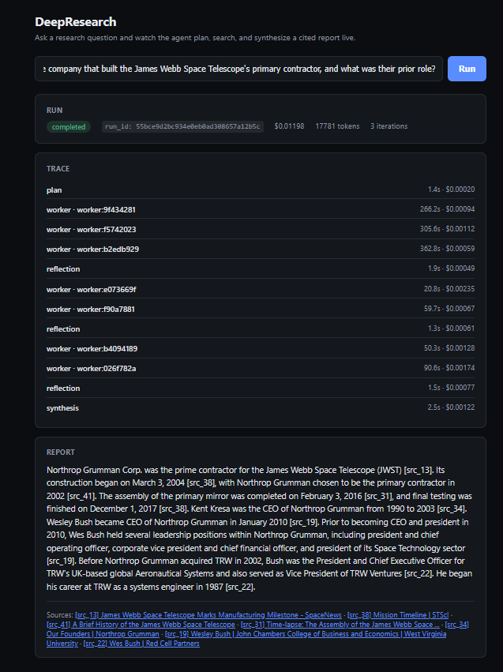

# DeepResearch

An agentic deep-research system: ask a question, get a cited report. Built
with the eval harness and CI regression gate as first-class parts of the
system, not an afterthought — every architectural choice (rerank on/off,
cache on/off, and the topology rebuild below) is backed by a measured
ablation, not a guess.

**Planner (dependency DAG) → supervisor (readiness-gated wave dispatch) →
ReAct subagents (search/calculate, inline per-hop verify) → synthesis →
bounded reflection**, all as one LangGraph `StateGraph`, with full tracing
(Langfuse Cloud/OTel), a Redis-backed search/fetch cache, hard budget
enforcement, and a Postgres run store behind it.

## Demo



```bash
python -m deepresearch.cli "Which came first, the Eiffel Tower or the Statue of Liberty?"
```

## Features

- **Multi-step research pipeline** — the planner emits a dependency DAG of
  sub-questions; a supervisor router fans out whichever nodes are ready
  each wave (parallel where independent, sequential where one hop depends
  on another's answer), each node is a tool-calling ReAct subagent with an
  inline per-hop verify/correction gate (`max_corrections`), and a bounded
  post-synthesis reflection step (`max_reflect`) decides whether real gaps
  remain.
- **Cited answers, checked for it** — claims map to source IDs and are
  checked post-hoc for citation coverage/precision, not just asserted.
- **Live streaming API + UI** — `GET /research/stream` (SSE) streams
  plan/worker/reflection/synthesis progress as it happens; a small demo UI
  ships at `/ui/`.
- **Full observability** — every run gets a trace ID shared with Langfuse,
  plus Prometheus/Grafana dashboards for cache hit rate and infra metrics.
- **Real eval harness, not a toy** — FRAMES + MuSiQue benchmark runs, a
  reliability job (repeat-run variance, not point estimates), and a
  DeepResearch Bench implementation, all against a local corpus for
  reproducible, CI-safe scoring.
- **CI regression gate** — every PR runs a smoke eval against a stored
  baseline and fails on accuracy/citation/latency regressions.
- **Every default is a measured ablation** — rerank on/off and cache on/off
  are backed by real numbers, including one case where a single run gave the
  wrong answer and a mandated 3x repeat reversed it. The old
  plan-first-vs-ReAct mode flag was itself an ablation finding: its reversal
  (react_agent's single-run accuracy edge didn't survive a 3x repeat) is why
  the topology was rebuilt into the one unified DAG graph above instead of
  shipping two competing modes.

## Setup

```bash
cp .env.example .env
# fill in ANTHROPIC_API_KEY and TAVILY_API_KEY
# sign up free at cloud.langfuse.com, create a project, fill in
# LANGFUSE_PUBLIC_KEY / LANGFUSE_SECRET_KEY
pip install -e ".[dev,eval]"
```

```bash
docker compose up --build -d   # starts the API, Postgres, Redis, Prometheus, Grafana
# (equivalent to `make up`, if you have make installed)
```
